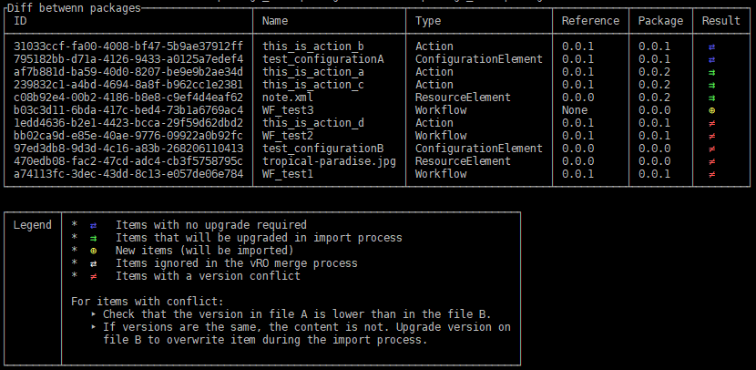

# vRO-package-diff tool

## Project description

vRO-package-diff is a Python package to compare 2 VMware vRealize Orchestrator packages.

It provides a table-formated diff of two packages.

## Installing

Install and update using pip:

    pip install click

vRO-package-diff supports Python 3.4 and newer.

## Usage example

    vro-diff --legend tests/data/package_v1.0.package tests/data/package_v1.1.package

## Documentation

[On ReadTheDocs](https://vro_package_diff.readthedocs.io/)
